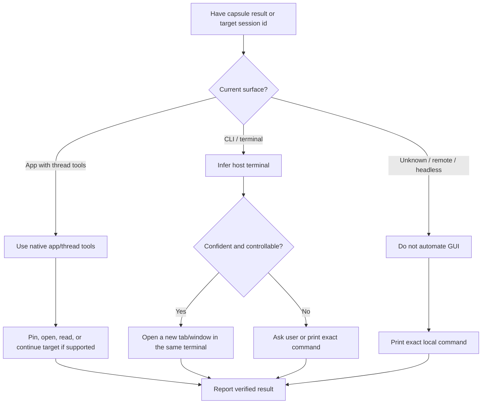

# Agent Capsule

## Overview

Agent Capsule is a CLI and capsule format for sharing coding agent sessions. Use this skill as the agent-facing operating guide; do not reimplement the capsule format in the prompt.

The CLI is the source of truth. A `.capsule.zip` or share link must remain self-bootstrapping for agents that do not have this skill installed.

## CLI Setup

Check whether the CLI is available:

```bash
command -v capsule
capsule help
```

If the user asked to export, share, import, restore, inspect, or verify a capsule and the CLI is missing, install it:

```bash
go install github.com/z2z23n0/agent-capsule/cmd/capsule@main
```

If `go` is missing or installation fails, report the exact blocker and do not invent a manual restore path.

## Export

For a normal handoff, export an encrypted share link:

```bash
capsule export --thread current
```

Only when the user explicitly asks for a local file or zip capsule, add
`--format zip`:

```bash
capsule export --thread current --format zip --name "<handoff topic>"
```

If the user provides a Worker or S3/R2 target, pass the matching `capsule export`
flags instead of uploading the raw session yourself.

If export fails with a secret-scan warning, stop and tell the user what was detected. Only rerun with `--unsafe-include-secrets` after explicit user approval. Secret scan covers session text, not OCR or image pixels, so remind the user to review screenshots and uploaded images when relevant.

Treat a full share URL containing `#k=...` as sensitive. The URL fragment is the decryption key.

## Import Or Restore

Accept either a local `.capsule.zip` path or an encrypted share URL. If a link is missing `#k=...`, ask for the full link before importing.

For zip capsules, read the embedded agent instructions when useful:

```bash
unzip -p <file>.capsule.zip AGENT_README.md
unzip -p <file>.capsule.zip agent/restore.md
```

For local zip capsules, inspect first:

```bash
capsule inspect <file>.capsule.zip
```

For encrypted share links, the browser preview and manifest validate that the link shape is usable. Do not spend an extra download on dry-run unless the user explicitly wants to preview planned writes.

Import into the intended project directory after the user approves local Codex history writes:

```bash
capsule import <file-or-url> --target codex --target-cwd . --execute
```

If the user asks to preview writes before importing, use the CLI dry-run mode:

```bash
capsule import <file-or-url> --target codex --target-cwd .
```

Agent Capsule import always creates a new Codex thread, like a session fork. Never design the workflow around replacing or overwriting the source thread, even when source and target use the same `CODEX_HOME`.

## Open Or Resume Result

When the user asks you to open, resume, or continue a capsule result, use the
user's current agent surface when possible. Do not assume you are running in
Codex; the current agent may be Codex, Claude Code, Cursor, OpenCode, or another
agent.



Prefer native app/thread tools over shell automation when available. For Codex
App, useful tools may include `set_thread_pinned`, `read_thread`, and
`send_message_to_thread`; pinning the target thread is preferred when direct
opening is unavailable.

In CLI/TUI, do not run a nested resume command inline in the active agent
session. Infer the host terminal from best-effort signals such as environment
variables, parent process chain, running apps, or app-state tools. Treat this as
heuristic, not ground truth; do not hard-code Terminal, Ghostty, iTerm2, Warp,
WezTerm, Kitty, Alacritty, or any other terminal as the default.

If detection is uncertain or GUI control is unsafe, ask the user which surface to
use, or print the exact command. Preserve the original model/provider when known.
If the normal launcher is blocked by wrapper or updater behavior, use a direct
installed binary only after confirming that blocker.

For Codex targets, the command shape is:

```bash
cd <cwd> && codex resume -m <model> <thread-id>
```

For non-Codex targets, use that runtime's equivalent resume or open command.
Claim success only after verifying through native app tools, terminal contents,
or process inspection.

For Codex targets, verify thread existence with narrow checks such as
`session_index.jsonl`, an exact session file path, or the specific resume
process. Avoid broad recursive scans of `CODEX_HOME`; local Codex histories can
be large and may include sensitive capsule URLs.

## Verify

After an executed import, verify the new thread id from the import result:

```bash
capsule verify --home "${CODEX_HOME:-$HOME/.codex}" --thread <new-thread-id> --target-cwd .
```

A capsule with `safety.status = blocked` can still be imported locally; treat it as a content warning that needs user awareness, not as a CLI runtime failure.

## Boundaries

Do not migrate provider credentials, auth sessions, cloud state, API keys, or assume encrypted reasoning can be cryptographically continued on another machine.

Do not write to local Codex history without `--execute` and explicit user approval. Dry-run remains available as an optional planned-write preview, but it is not required in the normal import flow.
