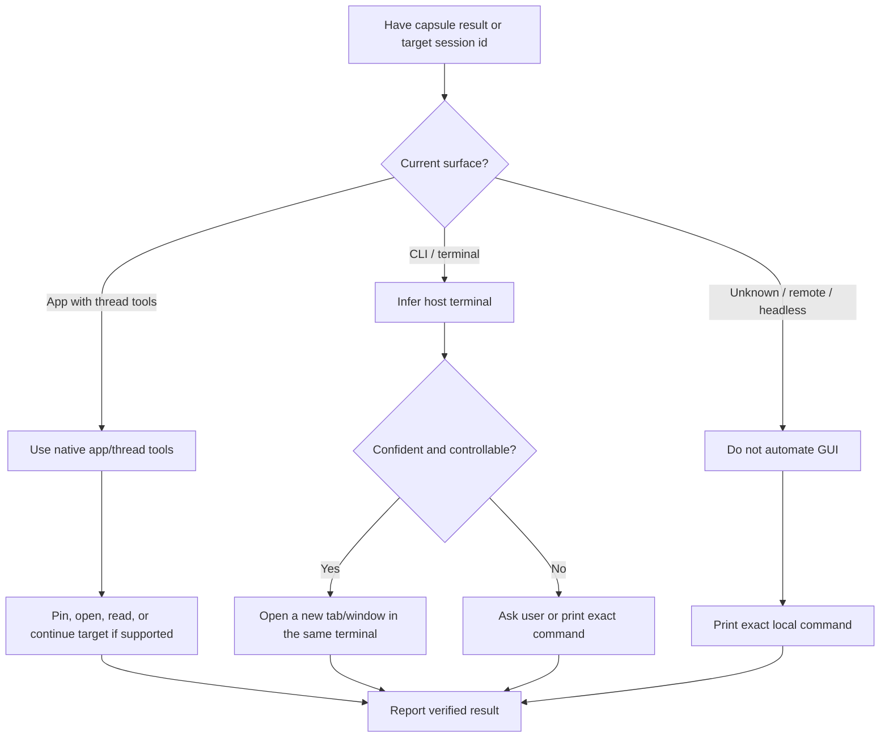

# Agent Capsule

## Overview

Agent Capsule is a CLI and capsule format for sharing coding agent sessions
across machines or agent runtimes through capsule artifacts. Use this skill as
the agent-facing operating guide; do not reimplement the capsule format in the
prompt.

The CLI is the source of truth. A `.capsule.zip` or share link must remain self-bootstrapping for agents that do not have this skill installed.

There are two separate workflows:

- Session handoff imports one conversation as a new thread/session.
- Codex profile migration preserves selected native thread ids and overwrites a controlled profile allowlist on a disposable target installation.

Never use session import semantics to approximate a profile migration.

## CLI Setup

Check whether the CLI is available:

```bash
command -v capsule
capsule help
```

For a profile migration, also require `capsule profile help` to succeed. If the
installed binary predates the profile command group, update it before starting.

If the user asked to export, share, import, restore, inspect, or verify a capsule and the CLI is missing, install the latest released binary:

```bash
curl -fsSL https://raw.githubusercontent.com/z2z23n0/agent-capsule/main/install.sh | sh
```

This normal install path does not require Go. It downloads a platform archive
from GitHub Releases, verifies `checksums.txt`, and installs `capsule` into
`~/.local/bin` unless `INSTALL_DIR` is set.

If the user explicitly asks to install from source for repository development,
use Go:

```bash
go install github.com/z2z23n0/agent-capsule/cmd/capsule@main
```

If installation fails, report the exact blocker and do not invent a manual restore path.

## Export Or Share

For a normal artifact handoff, export an encrypted share link. Codex remains the
default source; pass `--source claude` for Claude Code:

```bash
capsule export --source codex --thread current
capsule export --source claude --thread current
```

Only when the user explicitly asks for a local file or zip capsule, add
`--format zip`:

```bash
capsule export --source codex --thread current --format zip --name "<handoff topic>"
capsule export --source claude --thread current --format zip --name "<handoff topic>"
```

If the user provides a Worker or S3/R2 target, pass the matching `capsule export`
flags instead of uploading the raw session yourself.

If artifact export fails with a secret-scan warning, stop and tell the user what was detected. Only rerun with `--unsafe-include-secrets` after explicit user approval. Secret scan covers session text, not OCR or image pixels, so remind the user to review screenshots and uploaded images when relevant.

Treat a full share URL containing `#k=...` as sensitive. The URL fragment is the decryption key.

## Codex Mac-to-Mac Profile Migration

Trigger this workflow when the user asks to migrate, move, or copy their Codex
setup from this Mac to another Mac. If the user says to use Agent Capsule and
names a connected target device, treat that as approval to orchestrate the
source and receiver steps end to end. Use Codex Remote Connections and a
target-owned Codex task when available; this is task coordination, not remote
GUI control.

### Confirm The Boundary

Before writing anything, establish:

- the target Mac/host and target username;
- target `~/.codex` and project workspace paths;
- that controlled overwrite is acceptable;
- included or excluded project names.

List candidate project names when the project boundary is not already explicit.
Use `capsule profile discover --home "${CODEX_HOME:-$HOME/.codex}"` as the
source of truth for project roots and selected-thread counts.
Project migration includes committed Git state only. Uncommitted and untracked
files are excluded unless the user separately asks for them. Never include a
generic documents directory such as `~/Documents/Codex` merely because tasks
have used it as a cwd.

The target must have opened Codex at least once, be signed in, and have no local
data the user wants to keep. Do not migrate authentication, provider tokens,
Keychain data, installation ids, device enrollment, cookies, browser state,
managed plugins, caches, logs, worktrees, or `skills/.system`.

### Export On The Source Mac

Pass every approved project root explicitly. Prepare committed Git bundles as a
fallback for private remotes or local commits; they are not transferred unless
needed.

```bash
capsule profile export \
  --target-home /Users/<target-user>/.codex \
  --target-workspace /Users/<target-user>/workspace \
  --project /path/to/project-a \
  --project /path/to/project-b \
  --git-bundle-fallback \
  --out ~/.codex/profile-migrations/<migration-id>
```

Review the JSON clone plan and counts before continuing. Then start the
tokenized LAN server in a long-running terminal session:

```bash
capsule profile serve ~/.codex/profile-migrations/<migration-id> --listen :8765
```

The current hosted Worker/R2 link API is for individual session capsules, not
multi-GiB profile directories. Use this LAN streaming path unless a future
profile-specific multipart backend is explicitly available.

### Receive Through The Target Codex Task

Send the reachable tokenized URL to the target-owned Codex task and run:

```bash
capsule profile fetch <source-url> --out ~/.codex/profile-migrations/<migration-id>
capsule profile clone ~/.codex/profile-migrations/<migration-id>
capsule profile clone ~/.codex/profile-migrations/<migration-id> --execute
```

The first clone command is a dry run. If a remote clone fails because the target
lacks access or the exported commit was not pushed, fetch only the Git fallback
objects and retry:

```bash
capsule profile fetch <source-url> \
  --out ~/.codex/profile-migrations/<migration-id> \
  --include-git-bundles
capsule profile clone ~/.codex/profile-migrations/<migration-id> --execute
```

Do not copy project working trees over HTTP. Install or configure Git on the
target through its Codex task when needed.

### Offline Import And Restart

Run a dry import before scheduling the write:

```bash
capsule profile import ~/.codex/profile-migrations/<migration-id> --home ~/.codex
capsule profile schedule-import ~/.codex/profile-migrations/<migration-id> \
  --home ~/.codex --execute
```

The schedule command stages under `~/.codex`, creates a LaunchAgent with
`RunAtLoad=true` and `KeepAlive=false`, waits briefly, quits Codex, checkpoints
the target SQLite WAL, backs up the target state, imports, verifies, writes
`import-status.json`, reopens Codex, and removes its plist. Never replace this
with `launchctl submit`, a KeepAlive job, a Downloads-hosted script, or a child
process tied to the running Codex process.

The import preserves target authentication and remote-device identity. It
overwrites only the exported config/skill/memory/automation allowlist, keeps
`skills/.system`, rewrites source home/project paths, merges selected thread
rows, and rebuilds project/sidebar assignments.

### Verify And Clean Up

After the target Codex reconnects, inspect the status and run verification from
a target-owned task:

```bash
cat ~/.codex/profile-migrations/<migration-id>/import-status.json
capsule profile verify ~/.codex/profile-migrations/<migration-id> --home ~/.codex
capsule profile unschedule ~/.codex/profile-migrations/<migration-id> \
  --home ~/.codex --execute
```

Confirm database integrity, all selected session files and rows, rewritten cwd
and rollout paths, project Git roots, sidebar project assignments, user skills,
and MCP configuration. Report any MCP or GitHub CLI login still required on the
target. Stop the source `profile serve` process after verification.

## Artifact Import Or Restore

Accept either a local `.capsule.zip` path or an encrypted share URL. If a link is missing `#k=...`, ask for the full link before importing.

For zip capsules, read the embedded agent instructions when useful:

```bash
unzip -p <file>.capsule.zip AGENT_README.md
unzip -p <file>.capsule.zip agent/restore.md
```

For local zip capsules, inspect first:

```bash
capsule inspect <file>.capsule.zip
```

For encrypted share links, the browser preview and manifest validate that the link shape is usable.

Import into the intended project directory after the user approves local agent
history writes:

```bash
capsule import <file-or-url> --target codex --target-cwd . --execute
capsule import <file-or-url> --target claude --target-cwd . --execute
```

Agent Capsule import always creates a new native thread/session, like a session
fork. Never design the workflow around replacing or overwriting the source
thread/session, even when source and target use the same agent home.

Same-agent native import is raw-transcript lossless for the source runtime:
Codex -> Codex restores a new Codex thread, and Claude -> Claude rewrites the
Claude JSONL into a new `sessionId` under the target Claude project. Cross-agent
artifact import preserves visible messages, tool evidence, working context, and
a raw source sidecar under the target agent home.

## Open Or Resume Result

When the user asks you to open, resume, or continue a capsule result, use the
user's current agent surface when possible. Do not assume you are running in
Codex; the current agent may be Codex, Claude Code, Cursor, OpenCode, or another
agent.



Prefer native app/thread tools over shell automation when available. For Codex
App, useful tools may include `set_thread_pinned`, `read_thread`, and
`send_message_to_thread`; pinning the target thread is preferred when direct
opening is unavailable.

In CLI/TUI, do not run a nested resume command inline in the active agent
session. Infer the host terminal from best-effort signals such as environment
variables, parent process chain, running apps, or app-state tools. Treat this as
heuristic, not ground truth; do not hard-code Terminal, Ghostty, iTerm2, Warp,
WezTerm, Kitty, Alacritty, or any other terminal as the default.

If detection is uncertain or GUI control is unsafe, ask the user which surface to
use, or print the exact command. Preserve the original model/provider when known.
If the normal launcher is blocked by wrapper or updater behavior, use a direct
installed binary only after confirming that blocker.

For Codex targets, the command shape is:

```bash
cd <cwd> && codex resume -m <model> <thread-id>
```

For Claude Code targets, the command shape is:

```bash
cd <cwd> && claude --session-id <session-id>
```

For other non-Codex targets, use that runtime's equivalent resume or open command.
Claim success only after verifying through native app tools, terminal contents,
or process inspection.

For Codex targets, verify thread existence with narrow checks such as
`session_index.jsonl`, an exact session file path, or the specific resume
process. Avoid broad recursive scans of `CODEX_HOME`; local Codex histories can
be large and may include sensitive capsule URLs.

## Verify

After an executed import, verify the new thread id from the import result:

```bash
capsule verify --target codex --home "${CODEX_HOME:-$HOME/.codex}" --thread <new-thread-id> --target-cwd .
capsule verify --target claude --home "${CLAUDE_CONFIG_DIR:-$HOME/.claude}" --thread <new-session-id> --target-cwd .
```

A capsule with `safety.status = blocked` can still be imported locally; treat it as a content warning that needs user awareness, not as a CLI runtime failure.

## Boundaries

Do not migrate provider credentials, auth sessions, cloud state, API keys,
filesystem checkpoints, or assume encrypted reasoning can be cryptographically
continued in another runtime.

Do not write to local agent history without `--execute` and explicit user
approval, except when the user has directly asked this agent to perform a local
import and verification.
